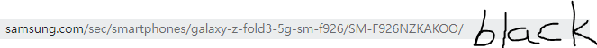
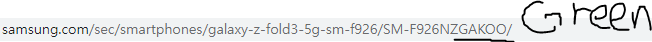

<!-- Heading -->

# 삼성전자 웹 스토어 클론 코딩

## **- 제작동기**

왜 대한민국 10대 20대 30대들의 스마트폰이 대부분 아이폰을..
 아니 애플 전자기기만 고집하는가.
 물론 스펙적인 부분이나 다른 운영체제에 대한 부분도 있지만 **'감성'** 때문이라고 생각한다.
 이 감성은 삼성전자와 애플 스토어에서도 차이가 나는데 **'삼성이 애플같은 감성이 있다면?'** 이라는 생각을 가지고 제작을 해봤다.

## **- 구성**

구성은

<!-- Boolet list -->

- Main
- Phone
  ~~- Watch~~
  ~~- Tablet~~
  ~~- Buds~~

총 4개의 웹페이지를 제작 예정

<!-- Link -->

애플의 디자인적인 감성과 삼성전자 온라인 스토어에서 사용하는 세련된 동작을 함께 넣어보려한다.

[애플 에어팟](https://www.apple.com/kr/airpods-3rd-generation/)

[삼성전자 버즈 프로](https://www.samsung.com/sec/buds/galaxy-buds-pro-r190/SM-R190NZWAKOO/)

### Main

- nav-bar

    각 카테고리 별 링크를 넣을 예정이며, Phone, Watch, Buds, Tablet만 제작 후 남은 Book,Accessory는 실제 삼성 링크를 넣음
    SAMSUNG로고는 기존 삼성전자 페이지에서 소스를 그대로 가져다 활용
    nav-bar 상단 고정
    JavaScript의 toggle을 활용하여 모바일에서 nav-bar를 간단하게 만듬

- unit

    베스트셀러 4가지를 main으로 함
    Main img들은 삼성전자 페이지에서 그대로 가져다 활용
    icon은 Font Awesome에서 활용
    `` tag를 활용한 링크 접속 활용

---

### Phone

- information

    JavaScript를 활용한 이미지 슬라이드 제작
    - 가로 축이 큰 container box 속에 각 이미지들을 배치한 후 button을 클릭하면 좌,우로 특정   값만큼 이동하게 하여 슬라이드 효과를 냄
    색상에 따른 이미지 변환 효과
    - 이미지 슬라이드에 있는 이미지들을 색상 별로 확인하기 위해 color button을 제작
    이후 원하는 색상을 클릭하게 되면 색상에 맞는 html로 이동하게 됌

- main-information

    flex를 사용한 layout
    JavaScript를 활용한 이미지 시퀀스 제작 - 특정 스크롤에 위치하여 있을 떄 이미지가 애니메이션처럼 움직이도록 함

---

22.01.21
 Main 4가지 베스트셀러 [The FreeStyle]에서 [Galaxy S7 FE]로 변경
 ~~font 반응형을 알아보고 추후 모바일에서도 접근가능하도록 할 예정~~
 모바일, 태블릿, PC에서의 각각 다른 화면비율값을 입력하여, 반응하도록 만들 예정 (미디어쿼리 사용할 생각)

22.01.23
 nav-bar 상단 fixed 업데이트
 한국적인 font 업데이트
 다음 Phone 웹 업데이트 예정 ( jQuery를 사용하지 않은 slider 제작 생각중 )

22.01.24
 Phone html 생성.
 JavaScript를 활용한 slider 제작

22.01.25
 slider 보완 및 마무리
 구매 창 html 생성
 Handler를 활용한 Phone img 변경 제작시작

22.01.26
 삼성 홈페이지에서 컬러별 이미지가 달라 Handler를 이용하기 까다로움
 삼성에선 원하는 컬러를 선택하면, 그 컬러에 맞는 html로 바뀌도록 만들었음
 NodeJS 강의 시청 후 서버가 바뀌는 것으로 확인.

 Black 색상의 주소
 
 Green 색상의 주소
 

phone.html을 3가지 컬러별로 만들어 원하는 색깔을 선택 시 그에 맞는 html로 이동하게 만듬
 위와 같이 html을 다르게 하면 각 컬러별로 사진뿐만 아니라 재고현황까지 편하게 관리가 가능함

22.01.29
 미디어 쿼리의 사용으로 반응형으로 개선
 자바스크립트 toggle을 활용한 nav-bar 개선

22.02.03
 Phone_information css 업데이트
 삼성 웹사이트를 살펴보니 윈도우 창에 반응하여 너비와 높이를 조절하는 자바스크립트를 만들 예정.

22.02.04
 윈도우 창에 반응하는 너비와 높이 조절을 할려했으나 모든 width와 heigh값을 바꿔야함.
 ( window.resize와 함수를 통한 사이즈 조절을 할려했으나 앞서 만든 모든 width와 height값을 바꿔야함.)
 반응형은 미디어쿼리로 할 예정.

22.02.05
 미디어 쿼리로 phone.html도 스마트폰에서 원활하게 사용가능
 phone_main_information 제작후 스크롤에 따른 애니메이션을 JavaScript로 제작 예정

22.02.07
 phone_main_information 제작완료
 footer 제작 예정
 반응형 추가할 예정

22.02.09
 phone_footer 추가
 미디어쿼리로 모바일에서도 볼 수 있도록 반응형 추가
 스크롤 반응형 애니메이션을 추가 할 예정
 계획에 있던 다른 전자부품 사이트는 만들지 않을 예정.

22.02.10
 이미지 시퀀스는 만들었으나 원하는 스크롤 위치에서 동작하는 것이 안됌. 다음 날 다시 해결해볼 예정.

22.02.11
 이미지 시퀀스를 원하는 스크롤 위치에서 동작하도록 만듬.
 삼성 웹 제작은 여기서 마무리 지으려함.
